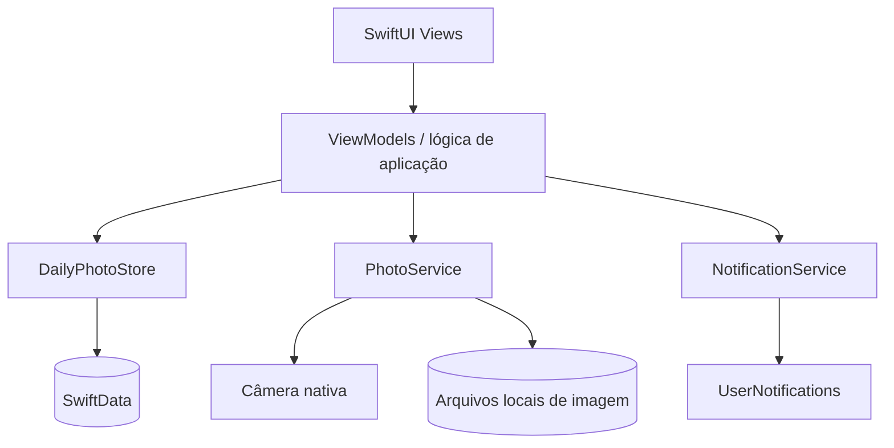

# Arquitetura inicial

## Estado

Este documento registra a arquitetura **planejada** para o MVP. O repositório ainda não contém projeto Xcode nem código-fonte.

O objetivo é manter poucas camadas, responsabilidades claras e dependências nativas. Novas abstrações só devem ser introduzidas quando resolverem um problema observado.

## Visão geral



Não se pretende implementar Clean Architecture completa. Os limites acima existem para impedir que Views concentrem regras de negócio ou acesso direto a arquivos e notificações.

## Responsabilidades

### SwiftUI Views

- renderizar estado e navegação;
- iniciar ações do usuário;
- apresentar câmera, confirmações, erros e estados vazios;
- respeitar acessibilidade e padrões visuais do iOS;
- não conter regras de unicidade nem manipulação direta de arquivos.

Telas iniciais esperadas: Hoje, Calendário, Timeline, Detalhe do registro e Configurações.

### ViewModels / lógica de aplicação

- coordenar os fluxos de criar, substituir, excluir e consultar;
- converter estado de serviços em estado de interface;
- aplicar a identidade do dia civil antes da persistência;
- decidir a ordem segura entre gravação de arquivo e atualização de metadados;
- manter lógica testável sem depender da hierarquia de Views.

ViewModels separados por fluxo são aceitáveis. Uma camada adicional de “use cases” não é necessária no início.

### DailyPhotoStore

- encapsular as operações usadas pelo app sobre `DailyPhoto`;
- consultar por chave de dia, mês e ordem cronológica;
- salvar e excluir metadados pelo `ModelContext` do SwiftData;
- traduzir conflitos de unicidade em erros do domínio.

Esse tipo é uma fronteira pequena sobre SwiftData, não um repositório genérico. Se o uso direto e testável de `ModelContext` se mostrar suficiente, ele pode permanecer mínimo.

### PhotoService

- coordenar a obtenção da imagem capturada pela interface nativa de câmera;
- validar e preparar o resultado para persistência;
- gravar a imagem em arquivo local;
- produzir miniatura sob demanda ou manter uma estratégia simples de cache;
- ler, substituir e remover arquivos;
- usar nomes opacos e devolver caminhos relativos, nunca caminhos absolutos persistidos.

A apresentação do controlador de câmera pertence à camada de interface. O serviço concentra o processamento e o armazenamento decorrentes da captura.

### NotificationService

- consultar o estado de autorização;
- solicitar permissão no contexto correto;
- criar, substituir e cancelar o lembrete diário local;
- manter um identificador estável para evitar agendamentos duplicados;
- expor falhas e restrições do sistema à lógica de aplicação.

### SwiftData

- persistir `DailyPhoto` e seus metadados;
- impor unicidade da chave canônica do dia, além da validação da aplicação;
- responder a consultas do calendário e timeline;
- não armazenar o conteúdo integral das fotografias.

## Armazenamento de imagens

As fotografias devem ser arquivos no contêiner privado do aplicativo. O SwiftData guarda somente um caminho relativo e os metadados necessários.

Estrutura lógica sugerida:

```text
Application Support/
└── DailyPhotos/
    └── <UUID>.<extensão>
```

O diretório exato e o formato da imagem serão confirmados na implementação. JPEG ou HEIF são opções compatíveis com o caso de uso; a escolha deve considerar qualidade, tamanho, orientação e custo de decodificação.

Razões para não guardar a imagem principal no modelo:

- evita inflar o armazenamento e as consultas do SwiftData;
- permite carregar miniaturas e imagens completas sob demanda;
- deixa explícito o ciclo de vida do arquivo;
- reduz acoplamento entre persistência de metadados e processamento de imagem.

O SwiftData oferece armazenamento binário externo, mas a decisão inicial é manter o arquivo sob controle do `PhotoService`, porque o app precisa de leitura, substituição, limpeza e geração de miniaturas explícitas.

### Ordem segura das operações

Criação:

1. preparar a imagem e gravá-la em arquivo temporário;
2. mover o arquivo para seu nome definitivo;
3. inserir e salvar os metadados;
4. remover o novo arquivo se a persistência falhar.

Substituição:

1. gravar a nova imagem com outro nome;
2. atualizar e salvar a referência do registro;
3. remover o arquivo anterior somente após o sucesso;
4. preservar a referência anterior se a atualização falhar.

Exclusão:

1. identificar com precisão entidade e arquivo;
2. excluir os metadados e coordenar a remoção do arquivo;
3. registrar ou reconciliar uma eventual falha de remoção, sem excluir arquivos não relacionados.

Banco e sistema de arquivos não compartilham uma transação. Por isso, operações idempotentes e uma verificação conservadora de arquivos órfãos são suficientes; não é necessário criar um subsistema complexo de sincronização.

## Fluxo principal

1. A tela Hoje calcula a chave do dia atual e consulta o `DailyPhotoStore`.
2. Sem registro, o usuário abre a câmera e confirma a captura.
3. O `PhotoService` grava a imagem.
4. A lógica de aplicação cria os metadados e solicita a persistência.
5. A View atualiza seu estado e mostra o registro concluído.
6. Se a chave já existir, o fluxo deve pedir substituição explícita em vez de inserir uma segunda entidade.

## Injeção de dependências

Dependências podem ser fornecidas na composição inicial do app por inicializadores ou pelo ambiente do SwiftUI. Protocolos pequenos são úteis nas fronteiras com arquivos e notificações para permitir testes, mas não devem ser criados para cada tipo por convenção.

Não é necessário adotar um contêiner de injeção de dependências no MVP.

## Tratamento de concorrência

- alterações de interface ocorrem no contexto apropriado à UI;
- leitura, codificação e gravação de imagens não devem bloquear a thread principal;
- o `ModelContext` deve respeitar seu isolamento;
- a operação de “consultar dia e criar” deve ter validação de aplicação e restrição persistente de unicidade para lidar com chamadas concorrentes.

A estratégia concreta de actors será definida com o código, sem antecipar uma hierarquia própria de concorrência.

## Decisões arquiteturais iniciais

| Decisão | Motivo | Estado |
| --- | --- | --- |
| Aplicativo exclusivamente iOS | foco em experiência nativa e escopo pequeno | decidida para o MVP |
| SwiftUI para interface | stack nativa declarativa planejada | decidida para o MVP |
| SwiftData para metadados | persistência local nativa com modelo pequeno | decidida para o MVP |
| Arquivos locais para fotos | evita grandes blobs no modelo e permite carregamento sob demanda | decidida para o MVP |
| Uma chave canônica por dia civil | permite consulta e unicidade independentes do horário de captura | decidida para o MVP |
| Sem backend ou CloudKit | funcionamento local-first e menor complexidade | decidida para o MVP |
| Serviços específicos, sem camada genérica | baixo acoplamento com pouco código cerimonial | decidida para o MVP |
| Formato final e política de compressão | requer testes de qualidade e armazenamento | em aberto |
| Deployment target | deve ser compatível com SwiftData, portanto iOS 17+ se a stack for mantida | em aberto |

## Possíveis evoluções

- miniaturas persistidas se a geração sob demanda não atender ao desempenho;
- exportação e backup manual;
- actor dedicado ao armazenamento se concorrência real justificar;
- migrações versionadas do schema;
- CloudKit como capacidade opcional, precedida por desenho de conflitos e privacidade;
- adaptação de layout para iPad e widgets.

Essas possibilidades não autorizam antecipar dependências, entidades ou camadas no MVP.

## Referências técnicas

- [SwiftData — documentação da Apple](https://developer.apple.com/documentation/swiftdata)
- [UserNotifications — documentação da Apple](https://developer.apple.com/documentation/usernotifications)
